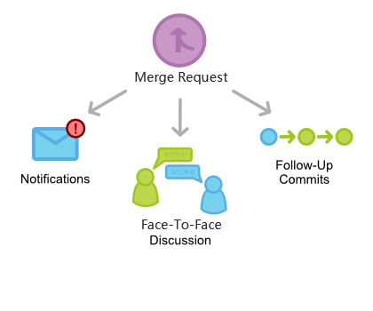
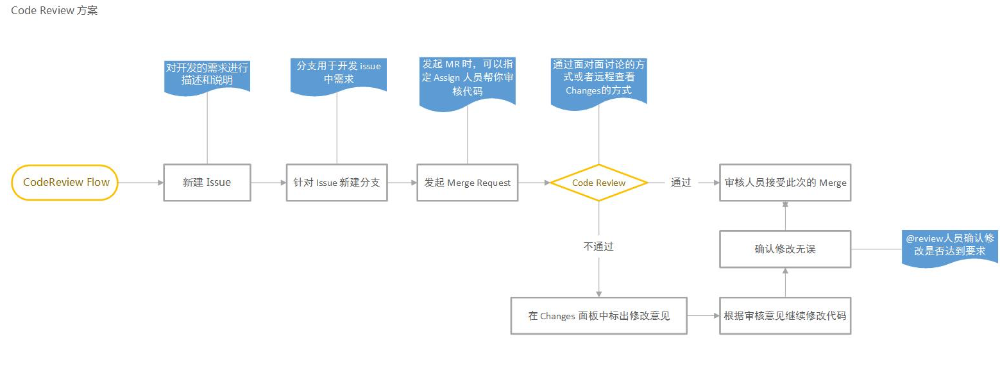

# Code Review 指南

## 目的
为了保证软件项目开发的代码实现质量，发现代码中的bug，保证项目组成员的沟通和对项目的了解，在实现功能的前提下，确保代码符合规范，同时保证代码的可读性和可维护性，因此需要进行阶段性Code Review（代码审查）。

## 模式

使用 Gitlab Merge Request（MR），通过 Face-To-Face 讨论方式来进行 Code Review，将提出的修改意见记录到 comments 里面，以便后续跟踪。时长控制在一个小时内。对于在外办公无法参加公司内部 Face-To-Face，则可以直接使用 Gitlab Merge Request（MR）的模式进行 Code Review。

## 流程

1. 使用 Issue 创建开发需求，最好能够对需求进行详细的描述和说明。
2. 在创建的 Issue 里面可以直接 Create New Branch。
3. 开发完成后，在自测无误情况下，可以发起一个 Merge Request 并且指定 Assign 人员处理最终的合并请求.
4. 在 Comments 里面可以 @reviewers 确认参加此次 review 的成员以及时间等事项。
5. 为了能够及时响应问题，减少分歧，增进交流，请尽量选择 Face-To-Face 的方式来进行 code review。
6. 对于 Code Review 中提出的问题可以记录在 comments 中，然后根据 Comments 进行修改。
7. 问题修改完成后，可以 @reviewer （提出该问题的人），进行确认。

## Code Review 的具体实施

### 事前准备阶段

1. 对象

    在准备 Code Review 代码对象时，我们要注意代码的数量，如果代码量比较大，要对代码进行必要的分解，确定其中的关键代码，对关键代码进行 Code
Review，可以达到举一反三的目的。

2. 内容

    我们对代码的审查内容很多，如代码的编写是否规范（注释的书写格式、命 名  规范等）、技术处理规范（异常处理、日志处理、代码组织结构等）、业务实现等。我们不能希望通过一次 Code Review 活动，完成所有这些内容的 审查， 因此我们必须设定本次 Coed Review 活动内容界限，确定审查重点.

3. 评审规范和标准

    在 Coed Review 前设计确定评审规范和标准是必要，通过规范和标准我们在审查过程中可以有据可依，有理可循，而且还可以做到标准统一。

4. 选择 Coed Review 活动的参与者

    在 Coed Review 开始前，必须把本次CR活动的对象、审查内容以及审查的规范和标准通报给所有的参与者。

5. 选择 Code Review 活动的实施方式。

    Coed Review 活动有很多形式可供我们选择，我们可以根据实际情况选择桌面式 Coed Review 、演示讲解式 Coed Review 、一对一的座位 Coed Review , 远程查看的 Coed Review 等等。

### Code Review 实施阶段

1. 准确记录

    对于 Code Review 过程发现的问题，我们必须清晰准确的记录，可以使用问题点记录单，明确记录的项目和内容。

2. 讲解与提问

    Code Review 过程中，要采用代码作者讲解和审查者提问方式。审查者不能只在发现问题时提问，同时也要根据本次审查的内容要求代码作者对某个特定问题的讲解。

3. 逐项审查

    对事前确定的审查内容，要逐项审查，不能因为时间不足等因素一扫而过。

4. 注意气氛

    实施审查时，要营造一个讨论问题、解决问题的氛围，不能把审查会搞成批判会，这样会影响相关人员的积极性。

### 事后跟踪跟踪

1. 确认发现的问题

    Code Review 结束后，对发现的问题，首先需要确定以下内容。

    - 问题点的难易程度以及影响的范围；
    - 解决问题的责任者和问题点修正结果的确认者；
    - 解决问题点的时限。

2. 修正问题责任者

    对于修正问题责任者，在问题点的修正过程中，要三方面内容的记录。

    - 问题点的原因；

    - 解决问题点的对策；

    - 修正的内容;
    - 完成修正后，通知确认者确认

3. 修正结果确认者

    做为修正结果的确认者，必须按照事前约定的时限及时的对修正结果进行全面的确认

## 注意事项

- 尽量保持短暂频繁的节奏

    要 Review 代码越多，那么建议也会越来越多，重写的代码也越来越多。而且越接近研发后期，代码也不能修改太多。尽量不要在小问题上纠结太久，如果当场无法确认，可以在事后考虑清除以后确认。

- 为什么需要使用面对面的方式

    主要是增进交流，即使响应，减少分歧，达成共识。

- 尽可能的让不同的人Reivew你的代码

    如果可能的话，不要总是只找相同的人群来Review你的代码，不同的人有不同的思考方式，有不同的见解，所以，不同的人可以全面的从各个方面评论你的代码。但不要太多了，人多嘴杂反而适得其反，基本上来说，不要超过3个人，这是因为，这是一个可以围在一起讨论的最大人员尺寸。

下面是几个优点：

1. 从不同的方向评审代码总是好的。
2. 会有更多的人帮你在日后维护你的代码。
3. 这也是一个增加团队凝聚力的方法。

## Ref

- [Code Review Guidelines - GitLab Documentation](https://docs.gitlab.com/ce/development/code_review.html)
- [如何用 Gitlab 做团队内的 Code Review](https://segmentfault.com/a/1190000006062488)
